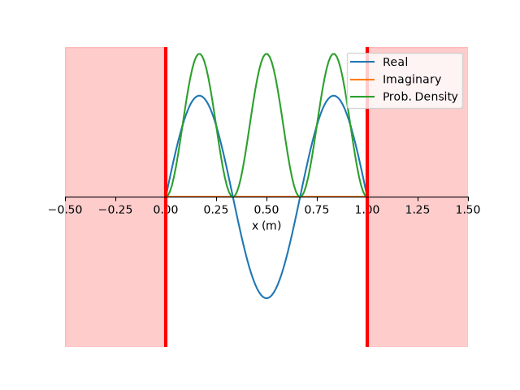

# Infinite Potential Sqaure Well Simulator

A Python-based computational model for visualising the time evolution of quantum wavefunctions in a 1D infinite potential well.

#### Video Demo:  <(https://youtu.be/O3T43Yoo6i8)>

#### Example

## Overview

This project simulates the time evolution of quantum wavefunctions in an infinite square well. The user can select a particle, define the well size, and construct a normalised wavefunction from multiple energy eigenstates.

## Physics

For a particle in an infinite square well, the energy of the nth stationary state is

E_n = n²π²ℏ² / (2mL²)

A general wavefunction can be constructed as a superposition of stationary states:

Ψ(x,t) = Σ c_n ψ_n(x)e^(-iE_nt/ℏ)

The probability density of the wavefunction is 

|Ψ(x,t)|^2

## Features

- Infinite square well simulation
- Electron, proton and neutron support
- Arbitrary superpositions of energy eigenstates
- Time-dependent wavefunctions
- Real and imaginary wavefunction components
- Probability density visualisation
- Animated time evolution
- For wavefunctions containing 2 or more superpositions, the time period is estimated numerically
- Automated tests using pytest

## Installation

Install the required dependencies in requirements.txt

## Usage

 - Run with `python project.py`
 - The user is prompted for a particle
 - The user is prompted for the size of the well (must be a positive real number)
 - The user is prompted for a wave function. This code supports any number of superposed states, but the wavefunction   must be noramlized
 - Press Ctrl+D after all required information has been entered to generate the animation.

## Future Development

Future developments of this work could involve implementing a finite potential well, a harmonic oscillator, and quantum tunnelling.

